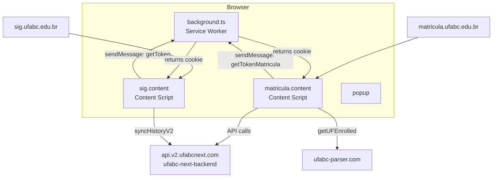
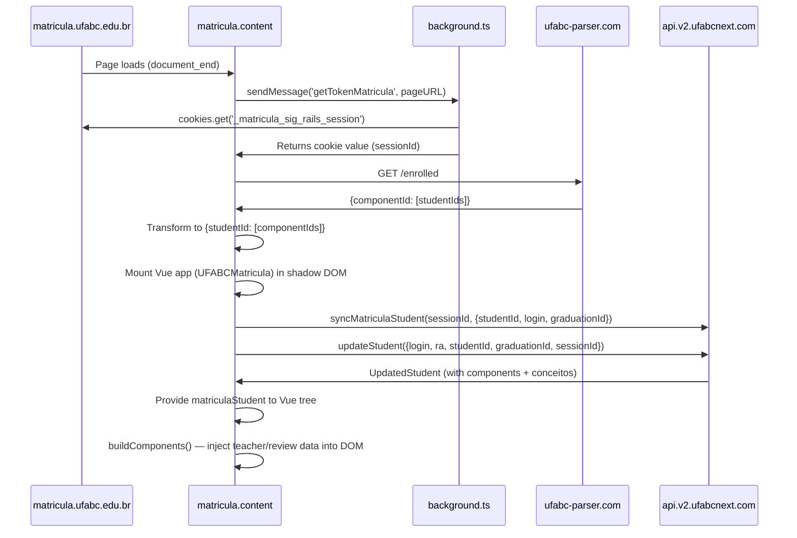
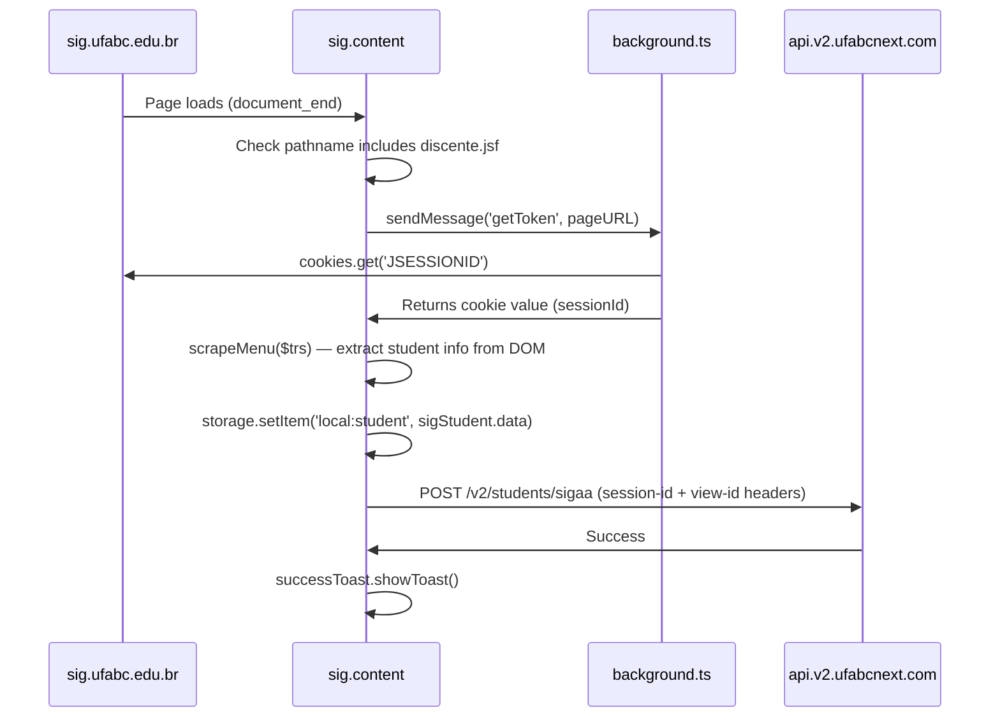
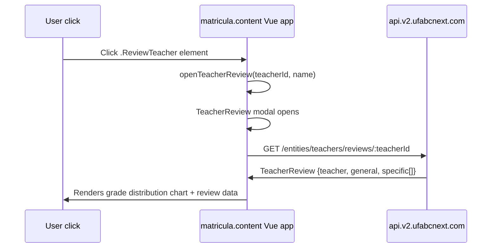

# ufabc-next-extension — Documentation

## 1. System Overview

### What this repo does and why it exists

`ufabc-next-extension` is a Chrome (and Firefox) browser extension that enhances the UFABC academic systems with UFABC Next data. It injects UI components into the UFABC enrollment portal and SIGAA, adds teacher/subject reviews, enrollment filters, and kick analysis. It also syncs student academic history to the `ufabc-next-backend` API.

**Who uses it:**
- UFABC students — directly, via browser
- `ufabc-next-backend` — receives synced data from this extension

**Where it fits:**
The extension is the primary data-sync mechanism: it reads session cookies from UFABC systems (that can't be accessed server-side), forwards them to the backend, and enriches the UFABC portal UI with data from the UFABC Next platform.

### Tech stack

| Layer | Technology | Version |
|---|---|---|
| Language | TypeScript + Vue 3 SFC | TS ^5.5, Vue ^3.5 |
| Extension framework | WXT | ^0.19.19 |
| Package manager | pnpm | ^9.15.4 |
| Node.js | >22 | — |
| UI framework | Element Plus | ^2.8.4 |
| CSS | Tailwind CSS | ^3.4 |
| State/data | @tanstack/vue-query | ^5.66 |
| Charts | Highcharts + highcharts-vue | ^12 / ^2 |
| HTTP client | ofetch | ^1.4 |
| Messaging | @webext-core/messaging | ^2.2 |
| Lint/format | Biome | ^1.9.3 |

---

## 2. Architecture

### Folder structure

```
src/
├── entrypoints/                    # WXT entry points — each becomes a separate bundle
│   ├── background.ts               # Service worker — handles cookie extraction
│   ├── matricula.content/          # Content script for matricula.ufabc.edu.br
│   │   ├── index.ts                # Mount point: injects filter UI, fetches enrolled students
│   │   ├── UFABC-Matricula.vue     # Root Vue component: campus/shift filters, cursadas/selected toggles
│   │   └── style.css               # Content script base styles
│   ├── sig.content/
│   │   └── index.ts                # Content script for sig.ufabc.edu.br: scrapes history, syncs to backend
│   ├── moodle.content/
│   │   └── index.ts                # Content script for moodle.ufabc.edu.br
│   └── popup/                      # Extension popup (toolbar icon click)
│       ├── App.vue
│       ├── index.html
│       └── main.ts
├── components/                     # Shared Vue components
│   ├── Cortes.vue                  # Enrollment cut data display
│   ├── KicksModal.vue              # Modal showing kick history for a component
│   ├── SubjectReview.vue           # Subject grade distribution + teacher reviews
│   ├── SubjectTeachersList.vue     # Teachers list for a subject
│   ├── TeacherReview.vue           # Teacher review modal
│   └── Teachers.vue                # Teacher info rendering
├── composables/                    # Vue composables
│   ├── useComponentsBuilder.ts     # Builds and injects teacher/subject data into UFABC DOM
│   ├── useFilters.ts               # Campus/shift filter state + DOM manipulation
│   ├── useModals.ts                # Modal open/close state management
│   └── useStorage.ts               # WXT storage access wrapper
├── services/                       # API client functions
│   ├── next.ts                     # UFABC Next backend API (https://api.v2.ufabcnext.com)
│   └── ufabc-parser.ts             # ufabc-parser API (https://ufabc-parser.com)
├── scripts/
│   └── sig/
│       └── homepage.ts             # Scrapes student info from SIGAA portal DOM
├── utils/
│   ├── grades-colors.ts            # Grade → color mapping
│   ├── remove-diacritics.ts        # String normalization
│   ├── season.ts                   # Current season calculation
│   ├── toasts.ts                   # Toast notification helpers
│   └── ufabc-matricula-student.ts  # Extracts student ID from UFABC DOM
├── assets/
│   └── tailwind.css                # Tailwind base styles
├── public/                         # Extension icons and static assets
└── messaging.ts                    # Extension messaging protocol definition
```

### Extension entry points

| Entry point | Type | Matches | Purpose |
|---|---|---|---|
| `background` | Service worker | — | Cookie extraction; receives messages from content scripts |
| `matricula.content` | Content script | `matricula.ufabc.edu.br/matricula/*`, `localhost/*`, snapshot Vercel URL | Injects filter UI into enrollment portal; syncs student data |
| `sig.content` | Content script | `sig.ufabc.edu.br/*` | Scrapes SIGAA history on student portal; syncs to backend |
| `moodle.content` | Content script | `moodle.ufabc.edu.br/*` | ⚠️ Not determined — see `src/entrypoints/moodle.content/index.ts` |
| `popup` | Popup | — | Extension toolbar popup UI |

### Browser permissions

- `storage` — WXT storage API for persisting student data locally
- `cookies` — Read UFABC session cookies (JSESSIONID, _matricula_sig_rails_session, MoodleSession)

### Host permissions

- `https://sig.ufabc.edu.br/*`
- `https://matricula.ufabc.edu.br/*`
- `https://moodle.ufabc.edu.br/*`

### Messaging protocol

Content scripts ↔ Background communication via `@webext-core/messaging`:

| Message | Sender | Handler | Returns |
|---|---|---|---|
| `getToken` | `sig.content` | `background` | `JSESSIONID` cookie |
| `getTokenMatricula` | `matricula.content` | `background` | `_matricula_sig_rails_session` cookie |
| `getTokenMoodle` | `moodle.content` | `background` | `MoodleSession` cookie |

### System context



---

## 3. Data Layer

No local database. Extension uses WXT storage (`wxt/storage`) for session-level data:

| Storage key | Type | Purpose |
|---|---|---|
| `local:fullStudent` | `MatriculaStudent` | Student data fetched from backend after matricula sync |
| `local:student` | SIGAA student data | Student info scraped from SIGAA portal |

All persistent academic data lives in `ufabc-next-backend` MongoDB.

---

## 4. API and Contracts

### Backend API (`https://api.v2.ufabcnext.com`)

Called by `src/services/next.ts`:

| Function | Method | Path | Description |
|---|---|---|---|
| `syncHistory` | POST | `/histories` | Legacy: sync student history (with session-id + view-state headers) |
| `syncHistoryV2` | POST | `/v2/students/sigaa` | Sync history from SIGAA (with session-id + view-id headers) |
| `sendResults` | POST | `/v2/components/archives` | Send enrollment archive data |
| `getSubjectReviews` | GET | `/entities/subjects/reviews/:subjectId` | Subject grade distribution + teacher data |
| `getTeacherReviews` | GET | `/entities/teachers/reviews/:teacherId` | Teacher review data |
| `getComponents` | GET | `/entities/components` | List components for current season |
| `getKicksInfo` | GET | `/entities/components/:kickId/kicks?studentId=` | Kick data for component |
| `getStudent` | GET | `/v2/students` | Get student by login (requires session-id header) |
| `syncMatriculaStudent` | PUT | `/v2/students` | Sync student from matricula system |
| `updateStudent` | PUT | `/entities/students` | Update student enrollment data |
| `getSigStudent` | POST | `/entities/students/sig` | Register/fetch student from SIGAA data |

**Auth**: All requests to the backend use session cookies passed as custom headers (not OAuth JWT). The backend validates the session with the UFABC portal.

### ufabc-parser API (`https://ufabc-parser.com`)

Called by `src/services/ufabc-parser.ts`:

| Function | Method | Path | Description |
|---|---|---|---|
| `getUFEnrolled` | GET | `/enrolled` | Get enrolled students per component: `{componentId: [studentIds]}` → transforms to `{studentId: [componentIds]}` |
| `getUFComponents` | GET | `/components` | Get all components for current season |

---

## 5. Background Jobs / Workers

No background jobs in the traditional sense. The background service worker only handles on-demand cookie retrieval messages from content scripts.

---

## 6. Configuration

No `.env` file. The extension has hardcoded service URLs:

| URL | Location | Purpose |
|---|---|---|
| `https://api.v2.ufabcnext.com` | `src/services/next.ts:145` | Production backend API |
| `https://ufabc-parser.com` | `src/services/ufabc-parser.ts:44` | UFABC parser service |

Extension ID is fixed via `manifest.key` in `wxt.config.ts` (Google public hash, not a secret).

Dev server runs on port 3002 (`wxt.config.ts:31`).

---

## 7. End-to-End Data Flows

### Flow 1: Student opens enrollment portal



### Flow 2: Student visits SIGAA portal



### Flow 3: User opens teacher review in enrollment portal



---

## 8. Technical Decisions

| Decision | Rationale |
|---|---|
| WXT framework | Handles browser extension build complexity (manifest generation, HMR, MV3 support) transparently |
| Shadow DOM injection | `createShadowRootUi` isolates extension CSS from UFABC portal styles |
| Cookie extraction via background | Content scripts can't access cookies directly in MV3; background service worker reads them via `browser.cookies.get()` |
| @webext-core/messaging | Type-safe, protocol-driven messaging between content scripts and background |
| @tanstack/vue-query | Caching and refetch management for component/review data fetched per-request |
| Hardcoded API URLs | Extension doesn't have env variables; URLs are compile-time constants |
| `session_access_level=TRUSTED_AND_UNTRUSTED_CONTEXTS` | Required for content scripts to access session storage set by background |

### Known technical debt

| Issue | Location |
|---|---|
| `@ts-ignore fix later` on `login` and `ra` in syncMatriculaStudent call | `UFABC-Matricula.vue:46-47` |
| Legacy `syncHistory` (v1) still in services | `services/next.ts:156` — replaced by `syncHistoryV2` |
| No tests | Entire codebase |
| Moodle content script not documented | `src/entrypoints/moodle.content/index.ts` |
| TODO comment: use extension storage | `UFABC-Matricula.vue:97` |

---

## 9. Contributor Guide

### Zero-to-running locally

```bash
# Prerequisites: Node >22, pnpm 9+, Chrome browser

# 1. Install dependencies
pnpm install

# 2. Dev mode (Chrome, hot reload)
pnpm dev

# 3. Load extension in Chrome:
#    chrome://extensions → Developer mode → Load unpacked → .output/chrome-mv3

# Firefox dev mode
pnpm dev:firefox
```

### Build for distribution

```bash
pnpm build          # Chrome MV3
pnpm build:firefox  # Firefox

pnpm zip            # Create .zip for Chrome Web Store submission
pnpm zip:firefox    # Create .zip for Firefox Add-ons
```

### Type check

```bash
pnpm compile        # vue-tsc --noEmit
```

### Lint + format

```bash
pnpm lint           # biome lint ./src
pnpm fmt            # biome format ./src --write
```

### Adding a new content script

1. Create `src/entrypoints/<name>.content/index.ts`
2. Export `default defineContentScript({ matches: [...], main: async () => {} })`
3. WXT auto-registers it; add `host_permissions` in `wxt.config.ts` if needed

### Adding a new background message handler

1. Add to `ProtocolMap` in `src/messaging.ts`
2. Add `onMessage('<name>', handler)` in `src/entrypoints/background.ts`
3. Call `sendMessage('<name>', data)` from content scripts

### Adding a new API call

1. Add function to `src/services/next.ts` (for backend) or `src/services/ufabc-parser.ts`
2. Use `nextService(path, options)` which wraps `ofetch.create({ baseURL: ... })`

---

## 10. Domain Glossary

| Term | Meaning |
|---|---|
| JSESSIONID | SIGAA Java session cookie |
| `_matricula_sig_rails_session` | Rails session cookie for UFABC matricula portal |
| MoodleSession | Moodle PHP session cookie |
| Content script | JavaScript injected into a web page by the extension |
| Service worker (background) | Persistent extension background process in MV3 |
| Shadow DOM | Isolated DOM subtree for injected UI (prevents CSS leakage) |
| MV3 | Manifest Version 3 — current Chrome extension format |
| WXT | Web Extension Tools — extension build framework |
| Kick (chute) | UFABC lottery that removes students from oversubscribed components |
| `cursadas` | Courses already taken (passed) by the student |
| Session sync | Extension forwarding UFABC session cookies to backend for data fetching |
